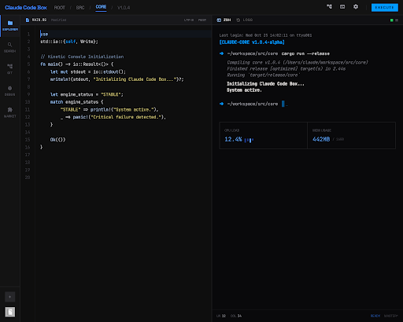
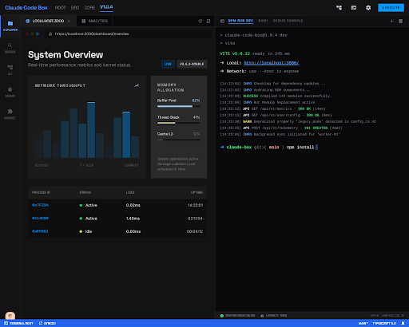
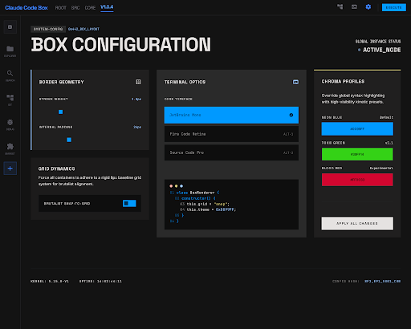
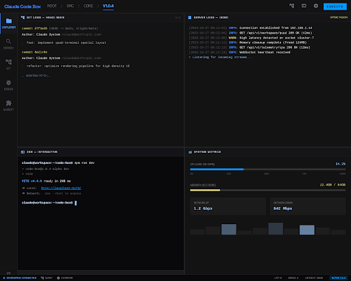

# Claude Code Box

> Lightweight cross-platform GUI for Claude Code CLI

**Claude Code Box**는 Claude Code CLI를 효율적으로 사용하기 위한 가벼운 데스크톱 IDE입니다.
좌측에 코드 에디터 또는 브라우저, 우측에 터미널을 배치하고, 터미널을 분할하여 Claude Code를 더 생산적으로 사용할 수 있습니다.

## Features

- **Monaco Editor** — VS Code 수준의 코드 편집기 (구문 강조, IntelliSense)
- **WebView Browser** — 내장 브라우저로 문서 참조하면서 코딩
- **Terminal Split** — 수평/수직 터미널 분할 (바이너리 트리 기반)
- **Quake Mode** — `Ctrl+\`` 글로벌 핫키로 앱 토글 (Tabby 스타일)
- **File Explorer** — 사이드바 파일 탐색기
- **Keyboard Shortcuts** — IntelliJ 스타일 단축키
- **Cross-Platform** — Windows, macOS, Linux 지원
- **Hyper-Terminal Design** — 사이버 브루탈리스트 다크 테마

## Screenshots

| Editor + Terminal | Browser + Terminal |
|:-:|:-:|
|  |  |

| Settings | Quad Terminal |
|:-:|:-:|
|  |  |

## Install

### Download

[Latest Release](https://github.com/inho-team/claude-code-box/releases/latest)에서 설치파일을 다운로드하세요.

| OS | Format |
|----|--------|
| Windows | `.exe` (NSIS Installer), Portable |
| macOS | `.dmg`, `.zip` |
| Linux | `.AppImage`, `.deb`, `.rpm` |

### Build from Source

```bash
git clone https://github.com/inho-team/claude-code-box.git
cd claude-code-box
pnpm install
pnpm dev        # Development
pnpm build      # Production build
pnpm dist       # Package installer
```

## Keyboard Shortcuts

| Shortcut | Action |
|----------|--------|
| `Ctrl+\`` | Quake mode (toggle window) |
| `Ctrl+O` | Open file |
| `Ctrl+S` | Save file |
| `Ctrl+W` | Close tab |
| `Ctrl+Shift+T` | New terminal |
| `Ctrl+Shift+Enter` | Split terminal horizontally |
| `Ctrl+Shift+\` | Split terminal vertically |
| `Alt+1~5` | Switch sidebar panel |
| `Alt+Left/Right` | Previous/Next tab |
| `Escape` | Focus editor |

## Tech Stack

- **Electron** + **React 19** + **TypeScript**
- **electron-vite** — Build tool
- **Monaco Editor** — Code editor (@monaco-editor/react)
- **xterm.js** + **node-pty** — Terminal emulator
- **Zustand** — State management
- **lucide-react** — Icons
- **Pretendard** — UI Font
- **FSD Architecture** — Feature-Sliced Design

## Project Structure

```
src/
  main/           # Electron main process
    index.ts      # BrowserWindow, Quake mode, Tray
    pty.ts        # node-pty terminal management
    file-system.ts # File I/O IPC handlers
    menu.ts       # Native application menu
  preload/        # contextBridge API
  renderer/       # React (FSD architecture)
    app/          # Entry, providers, ErrorBoundary
    config/       # Theme tokens
    entities/     # panel, terminal, editor stores
    features/     # terminal-split, panel-resize, editor-switch
    widgets/      # toolbar, sidebar, left-panel, right-panel, status-bar
    shared/       # hooks, lib, ui, styles
```

## Design System

"Hyper-Terminal" — 사이버 브루탈리스트 다크 테마.
자세한 내용은 [DESIGN.md](DESIGN.md)를 참조하세요.

| Token | Value |
|-------|-------|
| Accent | `#0099ff` |
| Background | `#131313` |
| Editor BG | `#0e0e0e` |
| Font (UI) | Pretendard |
| Font (Code) | JetBrains Mono |
| Border Radius | 0px |

## License

MIT
